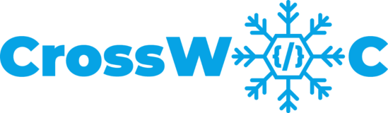

<h1 align="center">Awesome JavaScript Projects</h1>

## You can Have a look here [Website](https://vishal-raj-1.github.io/Awesome-JavaScript-Projects/)

[](https://GitHub.com/Naereen/StrapDown.js/graphs/commit-activity)
[](http://makeapullrequest.com)
[](https://github.com/ellerbrock/open-source-badges/)
[](https://github.com/dwyl/esta/issues)

[](https://github.com/Vishal-raj-1/Awesome-JavaScript-Projects/issues)
[](https://github.com/Vishal-raj-1/Awesome-JavaScript-Projects/network)
[](https://github.com/Vishal-raj-1/Awesome-JavaScript-Projects/stargazers)
<a href="https://discord.gg/tRmWXExVtw"></a>

Are you a Newbie in Web development and want to dive deep into Javascript?

<p align="center"></p>

Are you looking for some awesome Javascript Projects in which each and every project will teach you an important Javascript Concept?

<p align="center"></p>

Do you want to contribute to some Awesome Javascript projects and showcase your Javascript skills through it?🤩

<p align="center"></p>

Then, You got here right!! 

Awesome Javscript Projects Website contain many awesome Vanilla Javascript Projects in which each and every project will teach you some new and important javscript concepts. It includes concepts like Functional Components, Class Components, Math Objects, Arrow functions, APIs and many more.

The Main Motive of this project is to make you fall❌ rise ✅ in love with Javascript. You will be in love with the beauty of Javascript.

What we have for you here? 

<p align="center"></p>

So, What are you waiting for?


# Tech-Stack :
  

# Contribution is fun! :green_heart:

In order to make a hassle-free environment, I implore you all (_while contributing_) to follow the instructions mentioned below!

Happy Submissions :slightly_smiling_face:

## Contribution Guidelines🏗

Are we missing any of your favorite features, which you think you can add to it❓ We invite you to contribute to this project and make it better. 
To start contributing, follow the below guidelines: 

**1.**  Fork [this](https://github.com/Vishal-raj-1/Awesome-JavaScript-Projects) repository.

**2.**  Clone your forked copy of the project.

```
git clone https://github.com/<your_user_name>/awesome-javascript-projects.git
```

**3.** Navigate to the project directory :file_folder: .

```
cd awesome-javascript-projects
```

**4.** Add a reference(remote) to the original repository.

```
git remote add upstream https://github.com/vishal-raj-1/awesome-javascript-projects.git 
```

**5.** Check the remotes for this repository.

```
git remote -v
```

**6.** Always take a pull from the upstream repository to your master branch to keep it at par with the main project(updated repository).

```
git pull upstream main
```

**7.** Create a new branch.

```
git checkout -b <your_branch_name>
```

**8.** Perfom your desired changes to the code base.

**9.** Track your changes:heavy_check_mark: .

```
git add . 
```

**10.** Commit your changes .

```
git commit -m "Relevant message"
```

**11.** Push the committed changes in your feature branch to your remote repo.

```
git push -u origin <your_branch_name>
```

**12.** To create a pull request, click on `compare and pull requests`.

**13.** Add appropriate title and description to your pull request explaining your changes and efforts done.

**14.** Click on `Create Pull Request`.


**15** Voila :exclamation: You have made a PR to the awesome-javascript-projects :boom: . Wait for your submission to be accepted and your PR to be merged.

### This Project is a part of the following Open Source Program

<p align="center">
<a href="https://crosswoc.ieeedtu.in/"  target="_blank"> 
  
</a>
&nbsp;&nbsp;
<a href="https://gssoc.girlscript.tech/"  target="_blank"> 
   
</a>
</p>

## Project Maintainers 😃

<table>
  <tbody><tr>
    <td align="center"><a href="https://github.com/Vishal-raj-1"><br><sub><b> Vishal Rajput </b></sub></a><br><a href="https://github.com/Vishal-raj-1/Awesome-JavaScript-Projects/commits?author=Vishal-raj-1" title="Code">💻 </a></td> </a></td>
    <td align="center"><a href="https://github.com/urvashi-code1255"><br><sub><b>
 Urvashi Anand </b></sub></a><br><a href="https://github.com/Vishal-raj-1/Awesome-JavaScript-Projects/commits?author=urvashi-code1255" title="Code">💻 </a></td></a></td>
  </tr>
</tbody></table>

## Our valuable Contributors👩‍💻👨‍💻 :
<a href="https://github.com/Vishal-raj-1/Awesome-JavaScript-Projects/graphs/contributors">
  
</a>
